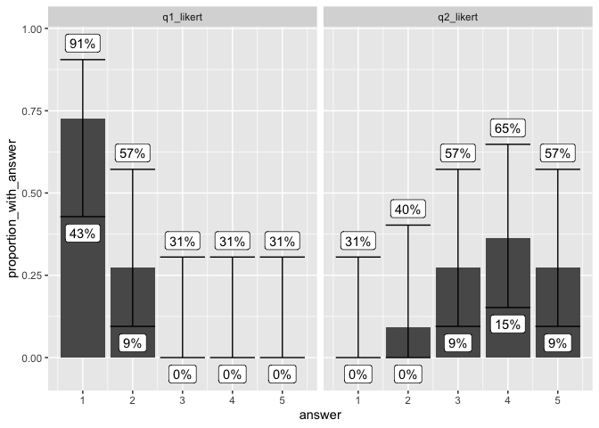

Estimating confidence intervals for likert style questions?
================

An exploration of approaches to confidence intervals. For
recommendation, see Version with wilson conf intervals, below.

In a survey we received 11 responses from 100 requests.

Some of the questions were likert scale answers (a 1-5 scale). We want
to produce estimates of the confidence interval for values in the
population. To do this we use the approach laid out here:
<https://online.stat.psu.edu/stat100/lesson/9/9.1> where we assume that
the responses in the sample are normally distributed. Thus the likely
error from sampling depends on the standard deviation of the metric in
the population. The approach assumes that the sample standard deviation
approximates the population standard deviation. I am a little uncertain
about doing this across the 1..5 range of the questions but see Version
with wilson conf intervals, below.

``` r
library(tidyverse)
library(knitr)
```

``` r
responses <- tribble(~response_id, ~q1_likert, ~q2_likert,
                     "response1", 1, 4,
                     "response2", 1, 3,
                     "response3", 2, 4,
                     "response4", 1, 4,
                     "response5", 1, 3,
                     "response6", 2, 5,
                     "response7", 1, 4,
                     "response8", 1, 3,
                     "response9", 2, 2,
                     "response10", 1, 5,
                     "response11", 1, 5)
```

First we can graph the responses just as they are.

``` r
responses %>% 
  # get one row per question, thus two rows per response.
  pivot_longer(cols = -response_id, names_to = "question", values_to = "answer") %>% 
  ggplot(aes(x = answer)) +
    geom_bar() + 
    facet_wrap(vars(question))
```

<!-- -->

Now we want to express the number of each response as a percentage. So
now we want a row per question and answer.

``` r
response_proportions <- responses %>% 
  # get one row per question, thus two rows per response.
  pivot_longer(cols = -response_id, names_to = "question", values_to = "answer") %>% 
  group_by(question, answer) %>% 
  summarize(response_count = n(), .groups = "drop" ) %>% # don't need groups later.
  complete(question, answer, fill = list(response_count = 0)) %>% # add zeros for unseen values
  # get total responses per question, add to each row.
  group_by(question) %>% 
  mutate(total_responses_for_question = sum(response_count)) %>% 
  # now get proportions for each question
  mutate(proportion_with_answer = response_count / total_responses_for_question)


kable(response_proportions)
```

| question  | answer | response_count | total_responses_for_question | proportion_with_answer |
|:----------|-------:|---------------:|-----------------------------:|-----------------------:|
| q1_likert |      1 |              8 |                           11 |              0.7272727 |
| q1_likert |      2 |              3 |                           11 |              0.2727273 |
| q1_likert |      3 |              0 |                           11 |              0.0000000 |
| q1_likert |      4 |              0 |                           11 |              0.0000000 |
| q1_likert |      5 |              0 |                           11 |              0.0000000 |
| q2_likert |      1 |              0 |                           11 |              0.0000000 |
| q2_likert |      2 |              1 |                           11 |              0.0909091 |
| q2_likert |      3 |              3 |                           11 |              0.2727273 |
| q2_likert |      4 |              4 |                           11 |              0.3636364 |
| q2_likert |      5 |              3 |                           11 |              0.2727273 |

Now we can use the `prop.test` function to get high and low confidence
values.

``` r
with_conf_vals <- response_proportions %>% 
  # run the prop.test on each row, store the result
  mutate(prop_results = map2(response_count, total_responses_for_question, prop.test, conf.level = .95)) %>% 
  # get the low/high results conf.int is a [low, high] list
  mutate(conf_low = map_dbl(prop_results, pluck, "conf.int", 1), 
         conf_high = map_dbl(prop_results, pluck, "conf.int", 2)) %>% 
  select(-prop_results)

kable(with_conf_vals)
```

| question  | answer | response_count | total_responses_for_question | proportion_with_answer |  conf_low | conf_high |
|:----------|-------:|---------------:|-----------------------------:|-----------------------:|----------:|----------:|
| q1_likert |      1 |              8 |                           11 |              0.7272727 | 0.3931661 | 0.9267233 |
| q1_likert |      2 |              3 |                           11 |              0.2727273 | 0.0732767 | 0.6068339 |
| q1_likert |      3 |              0 |                           11 |              0.0000000 | 0.0000000 | 0.3214479 |
| q1_likert |      4 |              0 |                           11 |              0.0000000 | 0.0000000 | 0.3214479 |
| q1_likert |      5 |              0 |                           11 |              0.0000000 | 0.0000000 | 0.3214479 |
| q2_likert |      1 |              0 |                           11 |              0.0000000 | 0.0000000 | 0.3214479 |
| q2_likert |      2 |              1 |                           11 |              0.0909091 | 0.0047639 | 0.4288308 |
| q2_likert |      3 |              3 |                           11 |              0.2727273 | 0.0732767 | 0.6068339 |
| q2_likert |      4 |              4 |                           11 |              0.3636364 | 0.1236508 | 0.6838637 |
| q2_likert |      5 |              3 |                           11 |              0.2727273 | 0.0732767 | 0.6068339 |

``` r
with_conf_vals %>% 
  # pivot_longer(cols = c(-question,-answer)) %>% 
  ggplot(aes(x = answer, y = proportion_with_answer, ymin = conf_low, ymax = conf_high)) +
  geom_bar(stat="identity") +
  geom_errorbar() +
  facet_wrap(vars(question))
```

<!-- -->

# Version with wilson conf intervals

With input from Mick McQuaid, and this Reddit thread:

<https://www.reddit.com/r/statistics/comments/10191m1/q_confidence_interval_for_likert_scale_data/>

lead to this paper:

Agresti, A., & Coull, B. A. (2024). Approximate Is Better than “Exact”
for Interval Estimation of Binomial Proportions.

And then to this code:

<https://rpruim.github.io/fastR2/reference/wilson.ci.html>

``` r
library(fastR2)
wilson.ci(8,11) %>% pluck(1)
```

``` r
# wilson.ci returns negative values, not relevant for percentages.
wilson_ci_with_zero_floor <- function(...) {
  result = wilson.ci(...)
  return(if_else(result < 0, 0, result))
}
```

``` r
with_conf_vals <- response_proportions %>% 
  # run the prop.test on each row, store the result
  mutate(prop_results = map2(response_count, total_responses_for_question, wilson_ci_with_zero_floor, conf.level = .95)) %>% 
  # get the low/high results conf.int is a [low, high] list
  mutate(conf_low = map_dbl(prop_results, pluck, 1), 
         conf_high = map_dbl(prop_results, pluck, 2)) %>% 
  select(-prop_results)

kable(with_conf_vals)
```

| question  | answer | response_count | total_responses_for_question | proportion_with_answer |  conf_low | conf_high |
|:----------|-------:|---------------:|-----------------------------:|-----------------------:|----------:|----------:|
| q1_likert |      1 |              8 |                           11 |              0.7272727 | 0.4281074 | 0.9052259 |
| q1_likert |      2 |              3 |                           11 |              0.2727273 | 0.0947741 | 0.5718926 |
| q1_likert |      3 |              0 |                           11 |              0.0000000 | 0.0000000 | 0.3053608 |
| q1_likert |      4 |              0 |                           11 |              0.0000000 | 0.0000000 | 0.3053608 |
| q1_likert |      5 |              0 |                           11 |              0.0000000 | 0.0000000 | 0.3053608 |
| q2_likert |      1 |              0 |                           11 |              0.0000000 | 0.0000000 | 0.3053608 |
| q2_likert |      2 |              1 |                           11 |              0.0909091 | 0.0000000 | 0.4024242 |
| q2_likert |      3 |              3 |                           11 |              0.2727273 | 0.0947741 | 0.5718926 |
| q2_likert |      4 |              4 |                           11 |              0.3636364 | 0.1520820 | 0.6479180 |
| q2_likert |      5 |              3 |                           11 |              0.2727273 | 0.0947741 | 0.5718926 |

``` r
with_conf_vals %>% 
  # pivot_longer(cols = c(-question,-answer)) %>% 
  ggplot(aes(x = answer, y = proportion_with_answer, ymin = conf_low, ymax = conf_high)) +
  geom_bar(stat="identity") +
  geom_errorbar() +
  geom_label(aes(y=conf_low, label = scales::percent(conf_low, accuracy = 1)), nudge_y=-0.05) + 
  geom_label(aes(y=conf_high, label = scales::percent(conf_high, accuracy = 1)), nudge_y=+0.05) + 
  facet_wrap(vars(question))
```

<!-- -->
